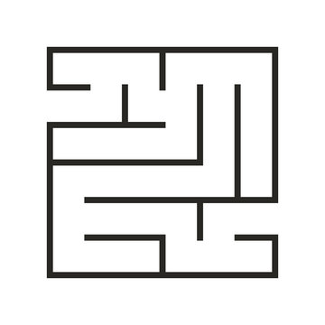

# Maze Solver using Q-learning

Implementation of Reinforcement learning, specifically Q-learning as an application for robotics to solve a maze based on a given input of an image of the maze. 
The project is a part of the course "MFG 598: Engineering Computing w/Python" under the guidance of Dr. Binil Starley at Arizon State University. 
The project is written in Python 3.11.5 and majorly uses the following libraries: numpy, matplotlib, pandas, cv2.

## Table of Contents

envCreating.py - Creates the environment for the maze taken the input of an image of a maze.  
gui.py - Creates a GUI for the maze environment. 
RLsolver.py - Solves the maze using Q-learning. 
mazeEnv.xlsx - Excel file containing the maze environment. 
QValues.json - JSON file containing the Q-values of the maze environment. Updated after every exploration cycle. 

The image of the maze used for this project is as below: 
 
The code is built to work with any maze image. The image of the maze can be changed by changing the path of the image in the envCreating.py file. 

## Explanation

Taking the input of the image, it creates a mask of the photo, to recognise the edges of the maze. The mask is then converted into a numpy array of 0s and 1s. The 1s represent the walls and 0s represent the path. The unneccesary space around the maze is ommitted in the np array and using the edges of the maze, the start and end of the maze is detected. The start is detected as the empty maze border in the top row or the lefmost column. The end is detected as the empty maze border in the bottom row or the rightmost column. The start and end points are then stored in a list.

The matrix is then converted into an excel file and is used as the initial environment for the maze. The Q-values are stored in a JSON file and are updated after every exploration cycle. The Q-values are then used to find the shortest path to the goal from the start point. The shortest path is then displayed on the GUI.

The rewards/penalty are as follows: 
Reward for winning - 10000 gives an incentive for the agent to reach the end of the maze 
Penalty for bumping into a wall - -5 
Penalty for each step - -0.1 

Since the maze is much bigger than the agent itself, the exploration of the maze is more important than expoitation. So the agent makes the move with the best Q-value with a probability of 0.7 and makes a random move with a probability of 0.3. This is done to ensure that the agent explores the maze and does not get stuck in a loop.

The Q-values are updated using the following formula: 
 

These QValues are saved in a JSON file, in the format "row col" as the key and the Qvalues of going up, down, left and right as the values in a single list. The Q-values are updated after every exploration cycle.

For better understanding of the exploration and exploitation, the Q-values are plotted as a heatmap once the exploration is complete.: 

## Contact Information

Name - Yashas Karthik 
Email - yashaskarthikb@gmail.com
